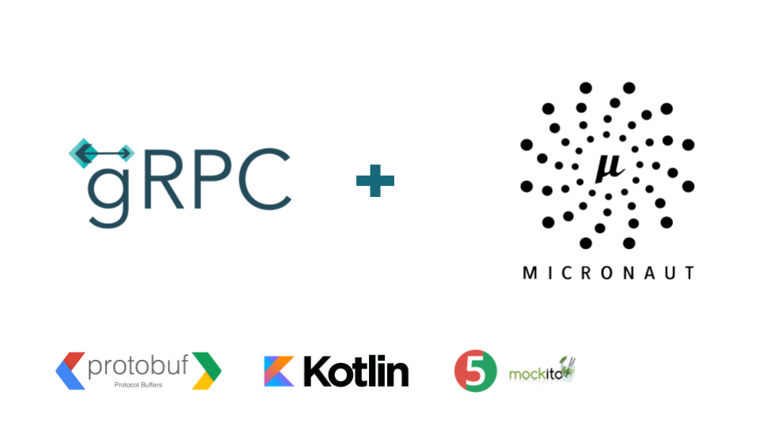
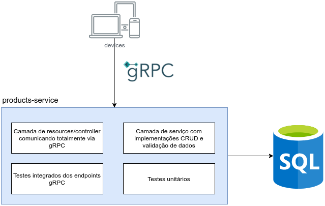

# Product Services
Um serviço de cadastro de produtos utlizando linguaguem Kotlin e a framewrok Micronaut e Grpc.

## GRPC
É um framework desenvolvido pela google que tem como objetivo facilitar o processo de comunicação entre sistemas de uma forma extremamente rapida, leve, independente de linguaguem de programação.
* Ideal para microserviços
* Mobile, browsers e Backend
* Geração das bibliotecas de forma automatica
* Streaming bidirecional utilizando o HTTP/2
* Contrato First

## Micronaut
É um framework que não utiliza reflection, ou seja, tudo acontece em tempo de compilação. diferente do spring.
* Tempo de inicialização rapida 
* Baixo consumo de memoria
* Cloud Native

## Stack
- 
## Estrutura do projeto desenvolvido

## :mortar_board: Autor
<table align="center">
    <tr>
        <td align="center">
            <a href="https://github.com/teteusAraujo">
                
                 
                <b>Mateus Araújo</b>
            </a>
        </td>    
    </tr>
</table>
<h4 align="center">
   Feito com 💜 by  <a href="https://www.linkedin.com/in/mateusaraujobarros/" target="_blank"> Mateus Araújo </a>
</h4>
